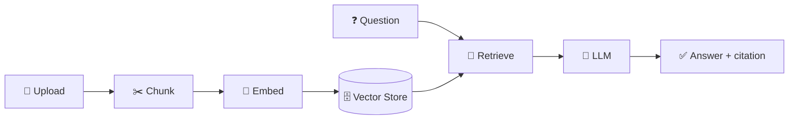

<div align="center">


**Upload any codebase. Ask questions in plain English. Get cited answers — file and line number included.**

[](https://codecompass-production-518f.up.railway.app)
[](https://www.python.org/)
[](https://fastapi.tiangolo.com/)
[](LICENSE)

</div>

---

## What is this?

CodeCompass is a **Retrieval-Augmented Generation (RAG) system for codebases**. Upload a project, ask questions like *"How does the login flow work?"*, and get an answer grounded in the actual code — with the exact file and line it came from, so you can verify it yourself.

## ✨ Features

- 📁 Upload as a `.zip` or a folder
- 🔍 Semantic search — finds code by meaning, not keyword matching
- 📌 Every answer cites its exact source (file + line range)
- 🤖 Multi-LLM: OpenAI, Google Gemini, or Anthropic Claude
- 🔒 Isolated, auto-expiring sessions — one upload never touches another
- ✅ Eval-gated CI/CD (RAGAS) + MLflow experiment tracking

## 🗺️ How it works



Each file is chunked, embedded, and stored in a session-scoped vector collection. A question is embedded the same way, matched against the closest chunks, and sent to an LLM with that context — the response includes exactly which file/lines it drew from.

## 🧠 Engineering highlights

- **RAG pipeline** with code-aware chunking (configurable size/overlap)
- **Multi-provider LLM abstraction** — one interface, three swappable backends
- **Eval-driven development** — RAGAS scoring gates every change in CI/CD
- **Experiment tracking** via MLflow
- **Swappable vector store** — Chroma or FAISS behind one interface
- **Non-blocking indexing** — heavy work runs in a thread pool so one large upload can't freeze the API for other users
- **Multi-tenant isolation** — per-session collections with TTL-based auto-cleanup, no per-user infra needed
- **API safety nets** — rate limiting, upload size limits, path-traversal protection

## 🛠️ Tech stack

| Layer | Tools |
|---|---|
| API | FastAPI + Uvicorn |
| Embeddings | `sentence-transformers` (`all-MiniLM-L6-v2`) |
| Vector store | Chroma or FAISS |
| LLMs | OpenAI, Gemini, or Claude |
| Evaluation | RAGAS (CI-gated) |
| Tracking | MLflow |
| Deployment | Docker on Railway |

## 🚀 Live demo

👉 **[codecompass-production-518f.up.railway.app](https://codecompass-production-518f.up.railway.app)** — no install needed.

## 💻 Run locally

```bash
git clone https://github.com/anjalinegi28/CodeCompass.git
cd CodeCompass
python -m venv venv && source venv/bin/activate   # Windows: venv\Scripts\activate
pip install -r requirements.txt
cp .env.example .env       # add your OPENAI_API_KEY / GOOGLE_API_KEY / ANTHROPIC_API_KEY
uvicorn app.api.main:app --reload
```

Open `http://localhost:8000`.

## ⚙️ Key config (`app/config.py`)

| Variable | Default | Purpose |
|---|---|---|
| `llm_provider` | `openai` | `openai` / `gemini` / `claude` |
| `embedding_model` | `all-MiniLM-L6-v2` | Embedding model |
| `vector_store` | `chroma` | `chroma` / `faiss` |
| `chunk_size` / `chunk_overlap` | `800` / `120` | Chunking strategy |
| `eval_threshold` | `0.70` | Min RAGAS score to pass CI |
| `max_upload_size_bytes` | `1 GB` | Upload size cap |

## 📂 Structure

```
CodeCompass/
├── app/
│   ├── api/            # FastAPI routes
│   ├── ingestion/       # Loading + chunking
│   ├── rag/             # Retrieval + generation
│   ├── vectorstore/      # Chroma / FAISS wrapper
│   ├── eval/             # RAGAS gate
│   └── config.py
├── static/               # Frontend
├── requirements.txt
└── railway.json
```

## ✅ Evaluation

Every PR runs a RAGAS gate automatically. Trigger it manually anytime:
```bash
curl -X POST http://localhost:8000/eval
```

## 🤝 Contributing

Issues and PRs welcome — please make sure the eval gate still passes.

## 👤 Author

**Anjali Negi** · [GitHub @anjalinegi28](https://github.com/anjalinegi28)

## 📄 License

[MIT](LICENSE)
